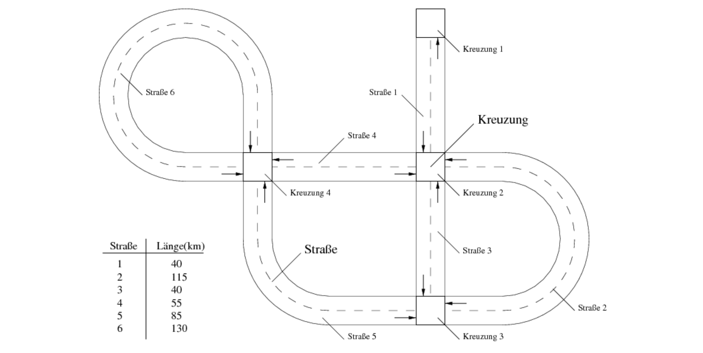
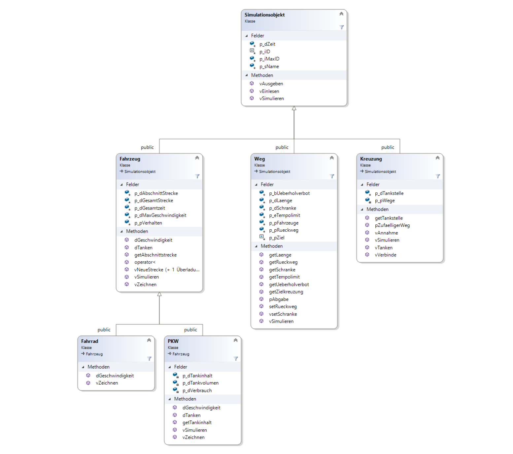
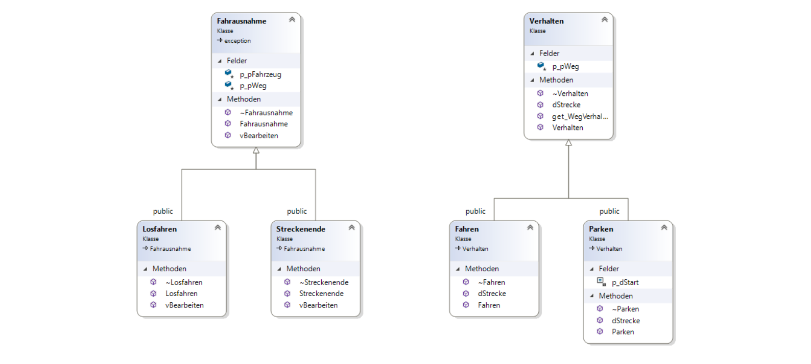

# Traffic Simulation System

A comprehensive, object-oriented 2D traffic simulation model built in C++17. This project simulates the flow of different types of vehicles across a complex network of roads and intersections, complete with a real-time graphical visualization interface. 

It was developed to apply advanced C++ concepts such as polymorphism, smart pointers, the Standard Template Library (STL), custom template design, and exception handling.

## Screenshots

**Real-Time Graphical Interface of Traffic Simulation (Java GUI):**


**Class hierarchy simulation object:**


**Exception and behavior classes**


## Features

* **Dynamic Vehicle Simulation:** Simulates different vehicle types (Cars, Bicycles) with unique behaviors, such as fuel consumption, dynamic speed reduction, and maximum speeds.
* **Complex Road Networks:** Supports roads with varying speed limits (Urban, Rural, Autobahn) and intersections that handle routing and vehicle transfers.
* **Smart Routing & Refueling:** Vehicles randomly navigate through intersections. Intersections are equipped with gas stations to automatically refuel cars as they pass through.
* **Delayed-Update Data Structures:** Implements a custom generic template list (`vertagt::VListe`) using the Command Pattern to ensure thread-safe and iterator-safe modifications during active simulation loops.
* **Event-Driven Exception Handling:** Utilizes custom exceptions (`Losfahren`, `Streckende`) to handle specific simulation events like vehicles starting their engines or reaching the end of a road.
* **Real-Time Graphical Interface:** Includes a Java-based GUI Server that communicates with the C++ client via TCP/IP sockets (Boost.Asio) to render the simulation live on a 2D map.

## Tech Stack

* **Language:** C++17
* **Standard Library:** STL (Containers, Algorithms, Random, Memory management with Smart Pointers)
* **Networking:** Boost.Asio (for TCP/IP Client-Server communication)
* **Visualization:** Java (A pre-compiled `SimuServer.jar` handles the graphical rendering)
* **Compiler:** GCC / Clang (macOS/Linux)

## Project Structure

All source code files (`.cpp`, `.h`) and the Java visualization server are located in the `src/` directory for straightforward compilation.

## Installation & Setup

To run this simulation locally, you will need a C++17 compatible compiler, the Boost library installed on your system, and a Java Runtime Environment (JRE) to run the visualization server.

### 1. Clone the repository
```bash
git clone [https://github.com/yourusername/TrafficSimulation.git](https://github.com/abdullokhakimov/TrafficSimulation.git)
cd TrafficSimulation

```

### 2. Install Dependencies

* **C++ Compiler:** Make sure `g++` or `clang++` is installed.
* **Java:** Install JRE (Java 8 or higher) to run the GUI.
* **Boost:** Install the Boost library.
* *macOS (Homebrew):* `brew install boost`
* *Ubuntu/Debian:* `sudo apt-get install libboost-all-dev`


### 3. Compile the Project

Navigate to the `src` directory and compile the source code.

**For macOS (using Homebrew Boost):**

```bash
cd src
g++ -std=c++17 *.cpp -o TrafficSim -I$(brew --prefix boost)/include -L$(brew --prefix boost)/lib -lboost_system -lpthread

```

**For Linux:**

```bash
cd src
g++ -std=c++17 *.cpp -o TrafficSim -lboost_system -lpthread

```

### 4. Run the Simulation

Execute the compiled binary from within the `src` directory so it can locate the `SimuServer.jar` file.

```bash
./TrafficSim

```

## Usage

When you run the application, the `main.cpp` file executes the final simulation setup.

1. A Java window will automatically open, displaying a 2D map.
2. The simulation initializes multiple intersections and connecting roads.
3. Vehicles (Audis, BMWs, BMX bicycles) are spawned at specific delayed times.
4. Watch the terminal for detailed logging of time steps, fuel consumption, exceptions caught (like road ends), and intersection transfers.
5. Watch the Java GUI for the live movement of the vehicles across the grid.

## Roadmap

Here are a few ideas planned for future updates to the project:

* **Traffic Lights:** Implement timed traffic lights at intersections to manage vehicle flow and cause traffic jams.
* **Pathfinding Algorithms:** Replace random intersection routing with Dijkstra's or A* algorithm so vehicles can travel to specific destinations.
* **Multi-threading:** Parallelize the simulation of individual roads to improve performance on massive road networks.

## Contact

**Abdulloh Khakimov**

**Email:** [abdullohxakimov7@gmail.com]

Feel free to reach out if you have any questions about the code or want to collaborate!
